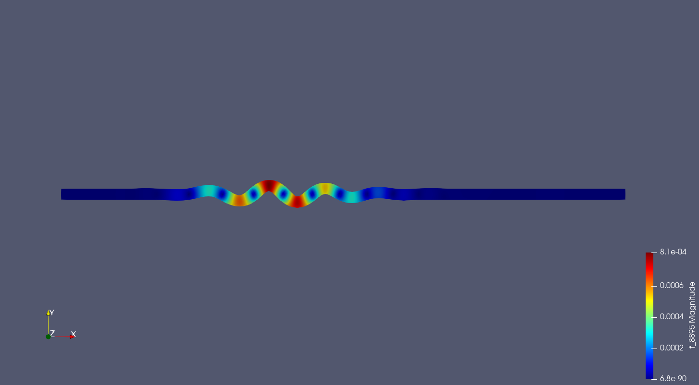

# Elastic_wave_on_plate

## Project Goal

The goal of the project is to compute the dispersion curves of waves on two-dimensional plate. To achieve our goal we must simulate the elastic wave propagation on plate changing the intensity and frecuency of the pulse located on the left part of the plate.

## Mathematical formulation

$$ \rho \frac{\partial^2 u_x}{\partial t^2} = \lambda \bigg( \frac{\partial^2 u_x}{\partial x^2} + \frac{\partial^2 u_y}{\partial x \partial y} \bigg) + 2\mu \frac{\partial^2 u_x}{\partial x^2} + \mu \bigg( \frac{\partial^2 u_y}{\partial x \partial y} + \frac{\partial^2 u_x}{\partial y^2} \bigg) $$

$$ \rho \frac{\partial^2 u_y}{\partial t^2} = \lambda \bigg( \frac{\partial^2 u_y}{\partial y^2} + \frac{\partial^2 u_x}{\partial x \partial y} \bigg) + 2\mu \frac{\partial^2 u_y}{\partial y^2} + \mu \bigg( \frac{\partial^2 u_x}{\partial x \partial y} + \frac{\partial^2 u_y}{\partial x^2} \bigg) $$

## Numerical Solution

The propagation of an ultrasonic pulse in a thin plate is computed solving the differential equations modeling this problem. To solve these equations finite differences are used to discretize the temporal variable, while spacial variables are discretized using Finite Element method. The free library software called FenicS written in Python is used to compute the approximated solution using polynomial triangular elements.
